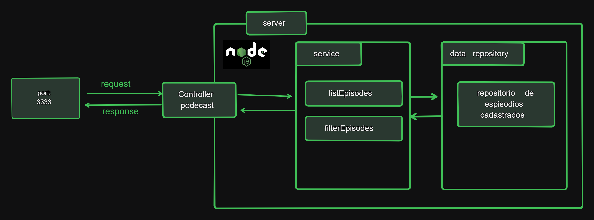

# Podcast Maneger


## Descrição

O Podcast Manager é uma aplicação inspirada no estilo da Youtube, que permite centralizar diferentes episódios de podcasts separados por categoria. Este projeto visa facilitar o acesso e a organização de episódios de podcasts em formato de vídeo, proporcionando uma experiência de navegação intuitiva e agradável para os usuários.

## Funcionalidades

- **Listar os episódios de podcasts em sessões de categorias:** Os episódios são organizados em categorias como saúde, bodybuilder, mentalidade e humor, permitindo aos usuários explorar facilmente os conteúdos disponíveis.
- **Filtrar episódios por nome de podcast:** Os usuários podem realizar buscas específicas por nome de podcast, facilitando o acesso aos episódios desejados.

## Implementação

### Listar os episódios de podcasts em sessões de categorias

- **Endpoint:** `GET /list`
- **Descrição:** Retorna uma lista de episódios de podcasts organizados por categorias.
- **Exemplo de resposta:**

```json
[
  {
    "podcastName": "flow",
    "episode": "SEGREDOS E CURIOSIDADES DA SÉRIE DO SENNA",
    "videoId": "13EWvfLeZJw",
    "categories": [
      "entretenimento",
      "esporte",
      "corrida"
    ]
  },
  {
    "podcastName": "flow",
    "episode": "OS BASTIDORES DA DUBLAGEM DE DESENHOS ANIMADOS com WENDELL BEZERRA",
    "videoId": "eyeqGn4PnNE",
    "categories": [
      "entretenimento",
      "dublagem"
    ]
  }
]
```

### Filtrar episódios por nome de podcast

- **Endpoint:** `GET /episode?p={nome}`
- **Descrição:** Retorna uma lista de episódios de podcast com base no nome do podcast fornecido.
- **Exemplo de requisição:** `GET /episode?p=flow`

## Tecnologias Utilizadas

- **[TypeScript](https://www.typescriptlang.org/):** Linguagem de programação utilizada para o desenvolvimento do projeto.
- **[Tsup](https://github.com/egoist/tsup):** Ferramenta de construção e empacotamento para projetos TypeScript.
- **[Tsx](https://github.com/egoist/tsx):** Compilador TypeScript que suporta a construção de projetos.
- **[Node.js](https://nodejs.org/):** Ambiente de execução JavaScript que permite executar código JavaScript do lado do servidor.
- **[@types/node](https://www.npmjs.com/package/@types/node):** Pacote de definições de tipos para Node.js para auxiliar no desenvolvimento com TypeScript.

## Como Utilizar

1. Clone este repositório.
2. Instale as dependências usando `npm install`.
3. Inicie o servidor executando `start:dev`.
4. Acesse os endpoints fornecidos para listar os episódios de podcasts ou filtrá-los por nome de podcast.

## Contribuição

Contribuições são bem-vindas! Sinta-se à vontade para abrir problemas ou enviar solicitações de recebimento (pull requests) para melhorar este projeto.

## Licença

Este projeto está licenciado sob a [MIT License](LICENSE).

<br>

## 👨‍💻 Sobre Mim
### Created by 💙 [@kleutons](https://github.com/kleutons)

### Contato
[](https://kleuton.dev) 

[](https://www.linkedin.com/in/kleuton-novais/)

[](https://www.dio.me/users/cleutoon)